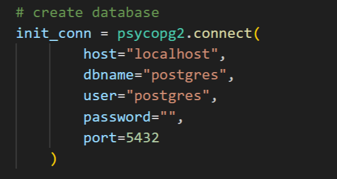

# HKOnlineDrinkScraper
This Python web scraping project scrapes data from three prominent online drink shops (Wellcome, PNS eSHOP, HKTVmall) in Hong Kong, then cleans and stores the collected data in a local database.

# Tools required
This project requires the user to install PostgreSQL and the administration tool pgAdin4 prior using the main application. Both the download link and the installation menu for PostgreSQL and pgAdmin4 can be found at (https://www.postgresql.org/) and (https://www.pgadmin.org/download/) respectively.

# Python libraries
All the scripts inside this project are written in Python. 3 libraries that need to be installed before running all the scripts. They are Selenium, requests, and psycopg2. Both Selenium and requests are used for web scraping while psycopg2 is used for creating the Postgres SQL database and moving data into it.

# Setup before using the application
Before running all the web scrapers with the  main.py file. It is important to note that the user is required to fill in the information for the initial connection information in the create_tables.py file after that, fill in the connection information for the database created prior in the db_config.py file. 
Here are the examples:

# Future features
1. Decrease the run time for the application by running 3 scripts concurrently
2. Further improvement and update for the code to make the application more stable
3. Having the database set up in a server allowing multiple people to access it at the same time    
